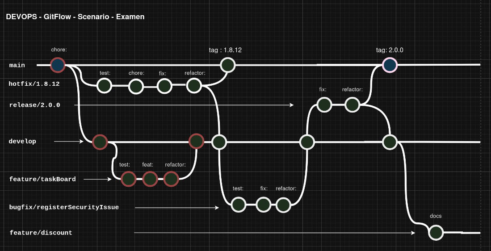
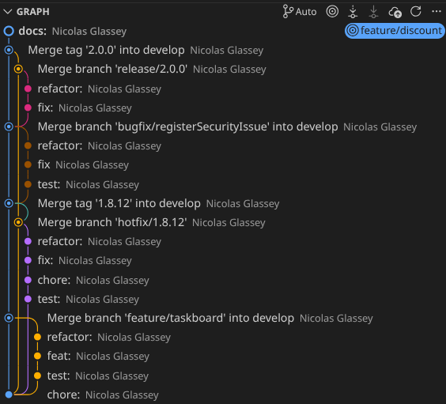

# DEVO - Evaluation pratique 2025-2026 - Gitflow

## Enoncé

Lors de cette épreuve, nous allons valider les compétences suivantes:

* utilisation des commandes git de base
* application correcte du git-flow (nvie)
* lecture et analyse d'un arbre (tree) produit par git-flow

## Moyens à disposition

| Critère              | Valeur        |
| --------             | -------       |
| Accès internet       | oui           |
| Travail collaboratif | non (sans IA) |
| Temps à disposition  | 45 min        |

## Pondération et barême

Cette évaluation vaut pour 50% de la note du module.

Le barême est l'habituel [nbPtsObtenus/nbPtsMaximum]/5*1

---

## Préparation de votre environnement

* Créer un fork du dépôt de l'enseignant

```
via l'interface graphique de Github
```

!!! Forkez toutes les branches !!!

* "Cloner" votre dépôt en local

```
git clone <votreUrl>
```

* Initialiser git-flow

```
git flow init -d
```

## Etat de l'arbre

* Schéma Draw IO



* Les "commits" rouges sont ceux déjà présents. Les autres sont à produire par vos soins.

#### Critères d'évaluation

| Critère    | Valeur | Pondération |
| -------- | ------- | --- |
| Hotfix | Toutes les étapes sont présentes | 4pts |
| Bugfix | Toutes les étapes sont présentes | 3pts |
| Release | Toutes les étapes sont présentes | 2pts |
| Chronologie des branches | Selon le schéma draw io   | 9pts |
| Bonnes pratiques de commits (préfixes) | Selon le schéma draw io   | 3pts |

---

## Arbre à obtenir à la fin du travail

### Version en ligne de commande

```git
git log --graph --oneline --decorate --all
```

```
* 4e77fe9 (HEAD -> feature/discount) docs:
*   e6e8f1c (develop) Merge tag '2.0.0' into develop
|\  
| *   9eb2eeb (tag: 2.0.0, main) Merge branch 'release/2.0.0'
| |\  
| | * 439af94 refactor:
| | * b70d614 fix:
| |/  
|/|   
* |   d62f0ca Merge branch 'bugfix/registerSecurityIssue' into develop
|\ \  
| * | e0cb23c refactor:
| * | bb97702 fix
| * | e2be451 test:
|/ /  
* | 8fccbaf Merge tag '1.8.12' into develop
|\| 
| *   9670693 (tag: 1.8.12) Merge branch 'hotfix/1.8.12'
| |\  
| | * afe8ab0 refactor:
| | * 9ea9400 fix:
| | * adcc09e chore:
| | * 0f07d37 test:
| |/  
* |   867b934 Merge branch 'feature/taskboard' into develop
|\ \  
| |/  
|/|   
| * a0b6cb0 refactor:
| * 003ff7a feat:
| * 2c09de6 test:
|/  
* f94f243 chore:
```

## Version graphique



## Modalités de livraison

* Une fois l'exercice terminé, synchronisez correctement votre dépôt local avec votre distant.
* Vous notifiez votre livraison à l'aide d'une issue (en "tag" l'enseignant).

BONNE CHANCE !!!


